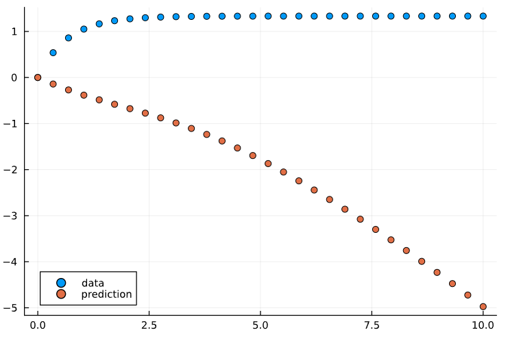
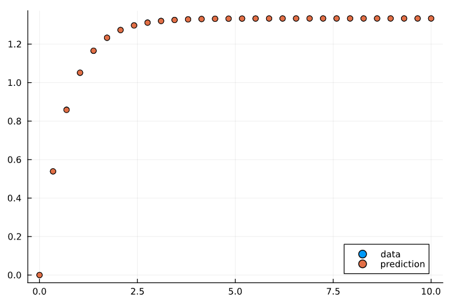
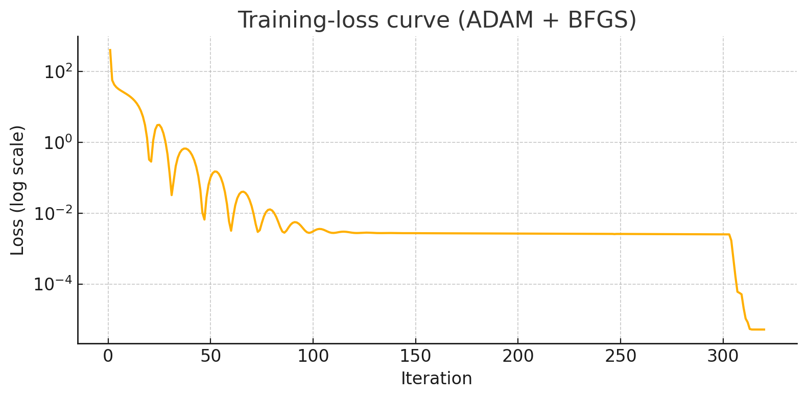

# Langmuir-Antibiotic Neural ODE (Julia)


The Langmuir adsorption model is described by the following differential equation:

$$
\frac{dq}{dt} = k_a \cdot C \cdot (Q_m - q) - k_d \cdot q
$$

<p align="center">
  
  
</p>

A **minimal yet complete Scientific-ML example** showing that a small Neural ODE can reproduce the classical Langmuir adsorption kinetics for antibiotics with sub-percent error.  
The project accompanies the paper <cite title to appear> and provides everything needed to:

- generate synthetic Langmuir data  
- train a Lux–based Neural ODE with an ADAM → BFGS pipeline  
- reproduce all plots, tables and final metrics reported in the manuscript  
- rebuild the LaTeX PDF

> **Repo URL:** <https://github.com/SAGAR-TAMANG/langmuir-antibiotic-neural-ode-julia>

---

## 📂 Repository layout

```text
.
├─ src/
│  ├─ julia.ipynb        # solves the Langmuir ODE
├─ assets/                      # generated PNGs (loss curve, trajectory comparison …)
├─ paper/
│  ├─ Neural ODE Surrogate for Langmuir Kinetics.zip   # arXiv‐style LaTeX source
├─ Project.toml               # Julia project manifest (Julia 1.10+)
├─ Manifest.toml              # exact package versions
├─ README.md                  # you are here
└─ LICENSE                    # MIT
```

---

## 🚀 Quick start

1. **Clone and instantiate** (Julia 1.10+):

   ```bash
   git clone https://github.com/SAGAR-TAMANG/langmuir-antibiotic-neural-ode-julia.git
   cd langmuir-antibiotic-neural-ode-julia
   julia --project -e 'using Pkg; Pkg.instantiate()'
   ```

2. **Launch the notebook**

   Open `src/julia.ipynb` in [JupyterLab](https://jupyter.org/) or VSCode.

   > Make sure to select the Julia kernel (matching this repo's environment).

3. **Run all cells**

   The notebook contains everything: Langmuir data generation, Neural ODE training (ADAM + BFGS), plots, and exported figures.

---

## ✨ Key results (default run)

| Stage          | MSE          | RMSE   |
| -------------- |-------------:|-------:|
| Initial random | 4.07 e+02    | 20.2   |
| After **ADAM** | 2.52 e-03    | 0.050  |
| After **BFGS** | 5.16 e-06    | 0.0023 |

<figure>
  
  <figcaption align="center"><b>Figure –</b> Loss curve of the training.</figcaption>
</figure>

---

## 🛠️ Main Julia packages

- [`DifferentialEquations.jl`](https://github.com/SciML/DifferentialEquations.jl) – ODE solver (Tsit5)  
- [`DiffEqFlux.jl`](https://github.com/SciML/DiffEqFlux.jl) – Neural ODE wrapper  
- [`Lux.jl`](https://github.com/LuxDL/Lux.jl) – pure-function neural networks  
- [`ComponentArrays.jl`](https://github.com/SciML/ComponentArrays.jl) – flat + named parameter containers  
- [`Optimization.jl`](https://github.com/SciML/Optimization.jl) – ADAM, BFGS optimisers

Fully specified versions live in `Manifest.toml`.

---

## 📇 Re-using the template

The code was written to be hackable:

* **Change network depth / width** in the notebook (`hidden_dim = 16`).
* **Add noise** in data cell (`ode_data .= ode_data .+ σ .* randn.`).
* **Swap optimiser** (`ADAM` → `RMSProp`, etc.) via `Optimization.solve`.

---

## 📙 Citation (Not Published Yet)

```bibtex
@misc{langmuir2025neuralode,
  author  = {Sagar Tamang},
  title   = {Neural Ordinary Differential Equations Reproduce Langmuir Antibiotic-Adsorption Kinetics},
  year    = {2025},
  url     = {https://github.com/SAGAR-TAMANG/langmuir-antibiotic-neural-ode-julia},
  note    = {GitHub repository}
}
```

---

## 📝 License

This project is released under the **MIT License** – see [`LICENSE`](LICENSE) for details. Contributions welcome via pull requests.

---

Happy modelling! 🎉
